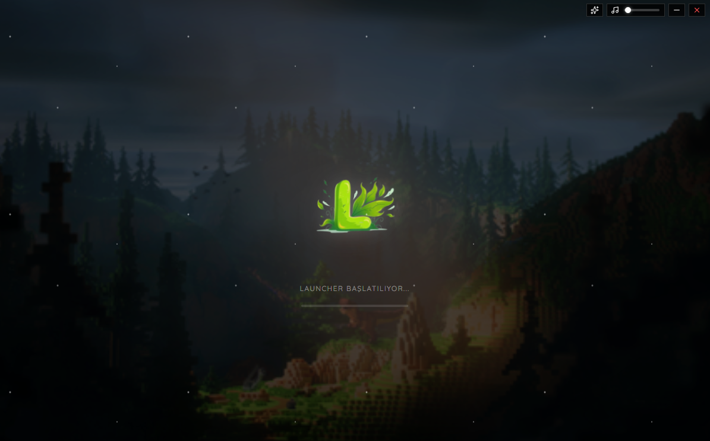
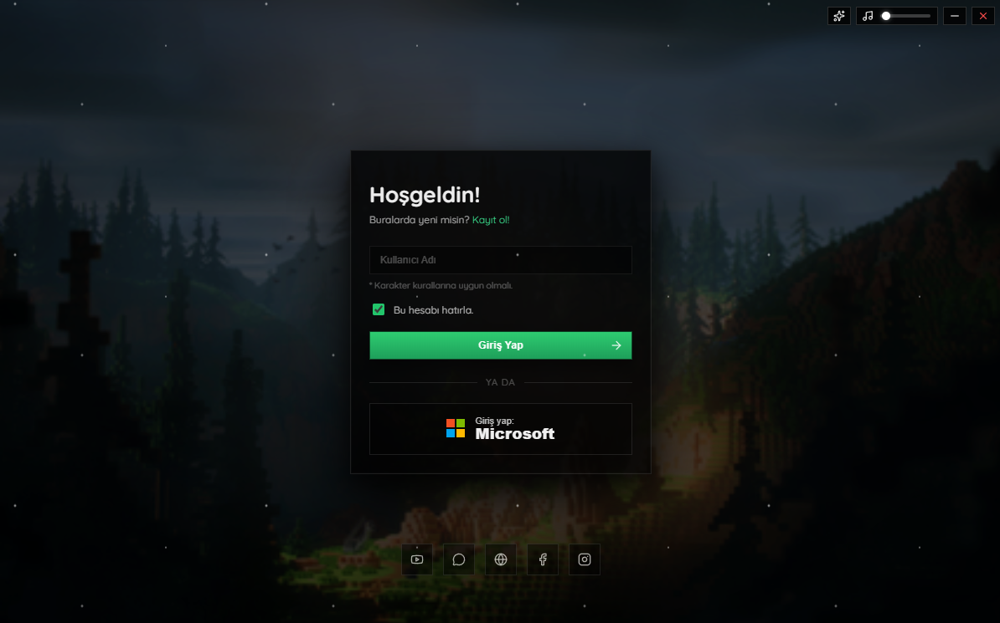
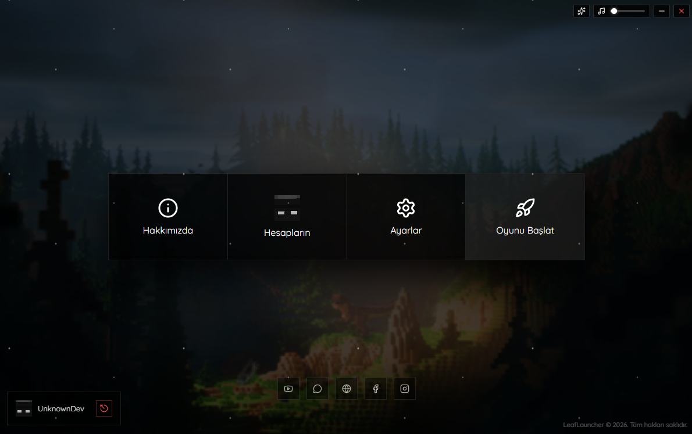
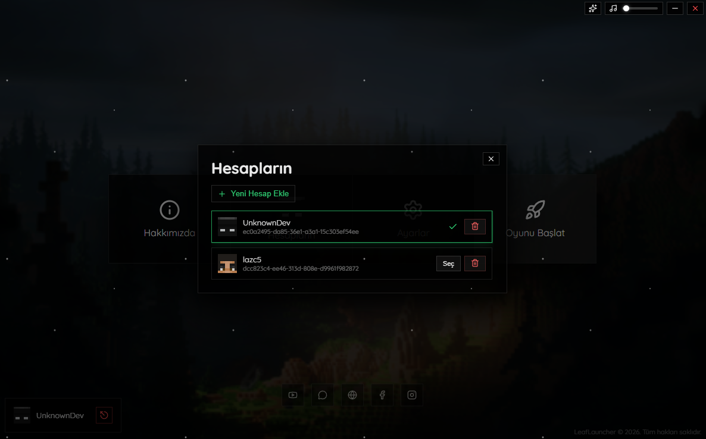
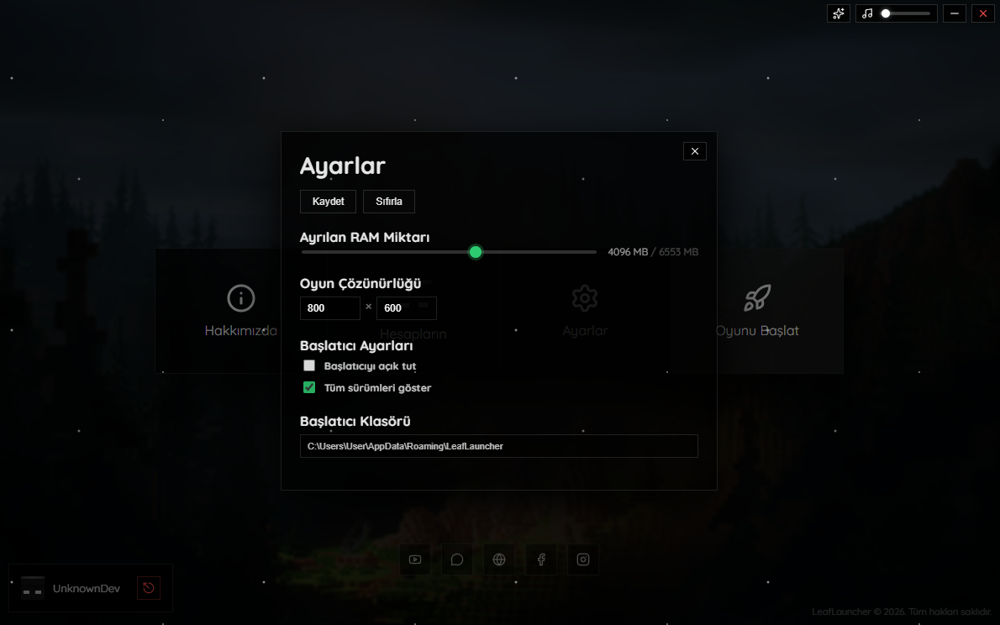
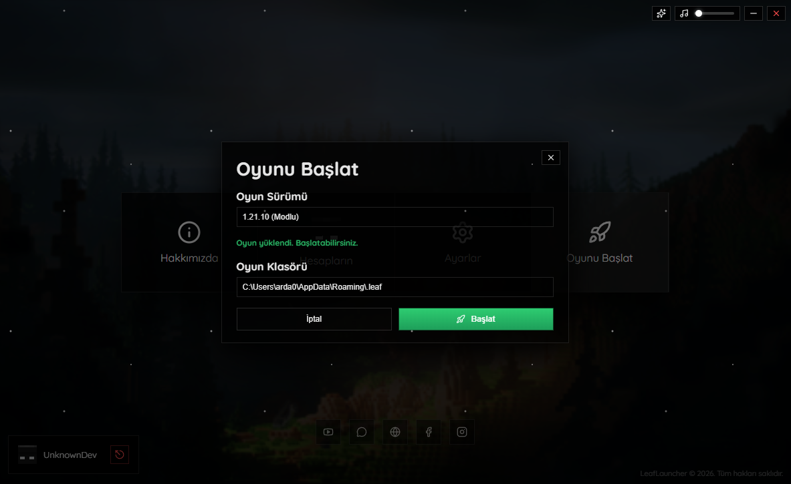

# 🍃 LeafLauncher

> 🚀 **Modern, ücretsiz ve açık kaynaklı Minecraft başlatıcısı**

LeafLauncher, **UnknownDev** tarafından aktif olarak geliştirilen; günümüzün en **güncel**, **yenilikçi** ve **kullanıcı dostu** Minecraft başlatıcılarından biridir.  
Diğer ücretli veya kapalı kaynak başlatıcıların aksine **tamamen ücretsiz** ve **açık kaynak** olarak sunulur. Böylece hem güvenli hem de özelleştirilebilir bir deneyim sağlar.

Kendi özel Minecraft başlatıcısını geliştirmek isteyenler, LeafLauncher’ı özgürce düzenleyip kullanabilir. 🍀

---

## ✨ Öne Çıkan Özellikler

- 🎨 Akıcı **animasyonlar** ve **ses efektleri**
- 🪟 Yumuşak geçişli **çoklu sayfa** ve **popup** içerikler
- 👤 **Hesap kayıt sistemi** ve çoklu hesap seçim ekranı
- ⚙️ Genişletilmiş **oyun içi** ve **başlatıcı ayarları**
- 🧼 Sade, modern ve **kullanışlı arayüz**
- 📦 **Snapshot sürümleri dahil** olmak üzere:
  - Mojang Studios tarafından yayımlanan **en eski** sürümden  
  - **En güncel** sürüme kadar tüm Minecraft versiyonlarına erişim
- 🔄 **Otomatik güncelleme sistemi** *(yakında)*
- 🧩 **Otomatik OptiFine & Forge / Fabric Loader** desteği *(yakında)*

---

## 🖥️ Desteklenen Platformlar

| Platform | Durum |
|--------|------|
| 🪟 Windows | ✅ Destekleniyor |
| 🍎 macOS | ❌ Yakında |
| 🐧 Linux | ❌ Yakında |

---

## 📦 Kurulum

1. GitHub **Releases** sayfasına gidin
2. En son sürümün **kurulum dosyasını** indirin
3. Kurulum dosyasını çalıştırın

⏱️ **10 saniyeden kısa sürede** kullanıma hazır!

---

## 🧪 Minecraft & Mod Desteği

- 🎮 Vanilla Minecraft: ✅ Destekleniyor
- 🧩 Mod Loader’lar: ❌ *(yakında)*
  - Forge
  - Fabric
  - OptiFine

---

## 🌍 Dil Desteği

- 🇹🇷 Türkçe

*(Diğer diller ilerleyen sürümlerde eklenebilir)*

---

## 🛠️ Kullanılan Teknolojiler

- ⚡ **Electron**
- ⚛️ **React**
- 🔥 **Vite**
- 🧠 Modern JavaScript / TypeScript mimarisi

---

## 📜 Lisans

Bu proje **MIT Lisansı** ile lisanslanmıştır.  
Dilediğiniz gibi kullanabilir, düzenleyebilir ve geliştirebilirsiniz.

> ⚠️ **Ticari amaç güdülmediği sürece** kullanımda herhangi bir kısıtlama yoktur.

---

## 🤝 Katkıda Bulunma

Katkılar her zaman açıktır!  
Pull Request gönderebilir, issue açabilir veya projeyi fork’layarak kendi başlatıcınızı oluşturabilirsiniz.

---

## 📢 İletişim

📌 Benimle iletişime geçmek için:
- 🌐 İnternet sitem üzerinden
- 💬 Discord üzerinden

---

## ⚠️ Yasal Uyarı

LeafLauncher, **Mojang Studios** veya **Microsoft** ile **resmi olarak bağlantılı değildir**.  
Minecraft, Mojang Studios’un tescilli markasıdır.

---

⭐ Eğer projeyi beğendiysen **star** atmayı unutma!

## 📷 Ekran Görüntüleri

| Bootstrap | Giriş | Ana Sayfa |
|----------|-------|---------|
|  |  |  |

| Hesaplar | Ayarlar | Oyna |
|----------|-------|---------|
|  |  |  |
